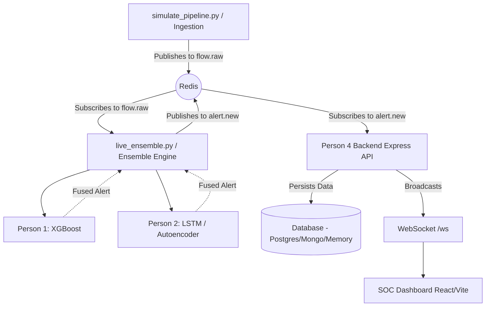

# SIH26145 - Unidirectional Threat Detector

The active implementation is the Agent 1 → Agent 2 pipeline. The older
ingestion, ensemble, and XGBoost components are preserved under
`archive/legacy/`; `ingestion/dataset/CICIDS2017_improved` remains the external
evaluation dataset.

On Linux, create or refresh the isolated environment and install all Python
and Node dependencies with `bash setup_linux.sh`. Train candidate models with
`.venv_linux/bin/python train_pipeline.py --output artifacts/pipeline/2.0.0-simulation`.
Start the backend, Agent 2 worker, dashboard, and offline simulator together
with `bash start_all.sh --sim`; stop only those child services with
`bash start_all.sh --stop`. Candidate policies intentionally report
`UNCERTAIN` until independently validated.

A modular, real-time Network Threat Detection system utilizing ensemble machine learning to identify both known attack signatures and novel zero-day anomalies in unidirectional network streams. This system is designed around a microservice-like architecture spanning data ingestion, supervised modeling, unsupervised/sequential modeling, backend APIs, and a real-time SOC dashboard.

---

## 🏗️ Architecture Overview

The pipeline operates entirely on a live streaming basis, decoupled by **Redis Pub/Sub**. The components are mapped to "Personas" from the SIH26145 specification:

1. **Ingestion Simulator** `(Person 3)`: Simulates real-time network flow data spanning multiple attack vectors (DDoS, Port Scan, Data Exfiltration, DGA, DNS Tunneling, C2 Beaconing) as well as benign traffic. Publishes JSON flow objects to the Redis `flow.raw` channel.
2. **Supervised Feature Engine** `(Person 1)`: Owns the XGBoost models trained on tabular features to identify explicitly known threat patterns (DDoS, Scans, Exfiltration, DGA, DNS Tunnels).
3. **Unsupervised & Sequential Deep Learning Engine** `(Person 2)`: Owns the Ensemble logic. It runs the Isolation Forest and Autoencoder (for zero-day anomalies), the PyTorch LSTM (for C2 beaconing sequences), and queries Person 1's XGBoost models. It fuses the scores and publishes the final threat verdict to the Redis `alert.new` channel.
4. **Backend API & Streaming** `(Person 4)`: An Express.js Node backend that subscribes to `alert.new`. It validates the schemas, persists the alerts to a database, and broadcasts them live to connected clients over WebSockets.
5. **SOC Dashboard**: A Vite + React frontend dashboard that connects to the Person 4 WebSocket and visualizes incoming attacks, severity levels, and threat categories in real-time.

---

## 🔄 How the Internal Modules Communicate

The modules do not call each other over HTTP; they use **Redis Pub/Sub** for decoupled, high-throughput streaming.



### Module Breakdown:
1. **`simulate_pipeline.py`** generates dictionaries of flow data (5-tuples, byte counts, packet sizes, inter-arrival times, DNS metadata) and pushes them as JSON strings to Redis.
2. **`ensemble_engine/scripts/live_ensemble.py`** loops continuously, picking up `flow.raw` events.
3. The Ensemble passes the flow to `ensemble.py`, which dynamically loads `xgboost_train/scripts/infer.py` and `ensemble_engine/scripts/infer.py`.
4. It fuses the predicted probability (`confidence_score`) and assigns a `threat_class` and `severity`.
5. The `alert.new` payload is picked up by `perosn4/backend/src/redis/subscriber.js` which saves it to the DB and relays it to all WebSocket clients.

---

## 🚀 How to Start the Project

The current launcher starts Redis (when it is not already running), the Agent 2
stream worker, backend, dashboard, and the offline simulator in one supervised
process tree.

### Prerequisites
- Python 3.10+
- Node.js 18+ and `npm`
- **Redis Server** running locally (test with `redis-cli ping` expecting `PONG`)

```bash
bash setup_linux.sh
bash start_all.sh --sim
```
Open `http://localhost:5173`. Stop the supervised process tree with
`bash start_all.sh --stop`. For passive receive-only capture, use
`bash start_all.sh --interface <monitor-interface>`; the interface must already
be configured by the operator.

The simulator generates packets locally and publishes observations to Redis;
it does not transmit attack traffic. The dashboard shows model evidence while
the candidate policy is unapproved, so decisions may remain `UNCERTAIN`.

---

## 🧠 Threat Classes & Detection Methods

| Threat Class | Responsible Component | Technique |
|---|---|---|
| **VOLUMETRIC_DDOS** | Person 1 (XGBoost) | High packet count and high packet rate per second. |
| **PORT_SCAN** | Person 1 (XGBoost) | Single packets per flow (SYN) targeting diverse ports. |
| **DATA_EXFILTRATION** | Person 1 (XGBoost) | High bytes transferred (`bytes_in` >= 50,000) over long durations. |
| **DGA** | Person 1 (XGBoost) | Lexical analysis of DNS query names for high entropy / randomness. |
| **DNS_TUNNELING** | Person 1 (XGBoost) | Exceptionally long DNS queries and high entropy subdomains. |
| **BOTNET_C2_BEACONING** | Person 2 (PyTorch LSTM) | Sequential analysis of inter-arrival times looking for rigid periodic beaconing. |
| **ANOMALOUS_UNCLASSIFIED** | Person 2 (Isolation Forest / Autoencoder) | Zero-day outliers that deviate significantly from the benign baseline distribution. |

## 🛠️ Testing & Evaluation
The repository includes dedicated test scripts that bypass stale data sets and evaluate the ML models on **live** simulated traffic to ensure there is no data leakage or overfitting.

```bash
./.venv_linux/bin/python -m pytest -q agent1_observation_dns/tests agent2_detection_product/tests
```
*This generates 300 fresh flows per class on-the-fly and scores them, generating a full classification report (F1-score >= 0.90 required).*
