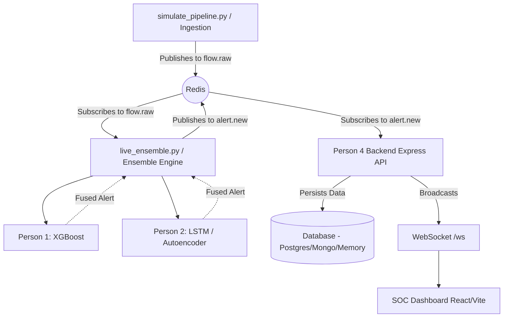

# SIH26145 - Unidirectional Threat Detector

A modular, real-time Network Threat Detection system utilizing ensemble machine learning to identify both known attack signatures and novel zero-day anomalies in unidirectional network streams. This system is designed around a microservice-like architecture spanning data ingestion, supervised modeling, unsupervised/sequential modeling, backend APIs, and a real-time SOC dashboard.

---

## 🏗️ Architecture Overview

The pipeline operates entirely on a live streaming basis, decoupled by **Redis Pub/Sub**. The components are mapped to "Personas" from the SIH26145 specification:

1. **Ingestion Simulator** `(Person 3)`: Simulates real-time network flow data spanning multiple attack vectors (DDoS, Port Scan, Data Exfiltration, DGA, DNS Tunneling, C2 Beaconing) as well as benign traffic. Publishes JSON flow objects to the Redis `flow.raw` channel.
2. **Supervised Feature Engine** `(Person 1)`: Owns the XGBoost models trained on tabular features to identify explicitly known threat patterns (DDoS, Scans, Exfiltration, DGA, DNS Tunnels).
3. **Unsupervised & Sequential Deep Learning Engine** `(Person 2)`: Owns the Ensemble logic. It runs the Isolation Forest and Autoencoder (for zero-day anomalies), the PyTorch LSTM (for C2 beaconing sequences), and queries Person 1's XGBoost models. It fuses the scores and publishes the final threat verdict to the Redis `alert.new` channel.
4. **Backend API & Streaming** `(Person 4)`: An Express.js Node backend that subscribes to `alert.new`. It validates the schemas, persists the alerts to a database, and broadcasts them live to connected clients over WebSockets.
5. **SOC Dashboard**: A Vite + React frontend dashboard that connects to the Person 4 WebSocket and visualizes incoming attacks, severity levels, and threat categories in real-time.

---

## 🔄 How the Internal Modules Communicate

The modules do not call each other over HTTP; they use **Redis Pub/Sub** for decoupled, high-throughput streaming.



### Module Breakdown:
1. **`simulate_pipeline.py`** generates dictionaries of flow data (5-tuples, byte counts, packet sizes, inter-arrival times, DNS metadata) and pushes them as JSON strings to Redis.
2. **`ensemble_engine/scripts/live_ensemble.py`** loops continuously, picking up `flow.raw` events.
3. The Ensemble passes the flow to `ensemble.py`, which dynamically loads `xgboost_train/scripts/infer.py` and `ensemble_engine/scripts/infer.py`.
4. It fuses the predicted probability (`confidence_score`) and assigns a `threat_class` and `severity`.
5. The `alert.new` payload is picked up by `perosn4/backend/src/redis/subscriber.js` which saves it to the DB and relays it to all WebSocket clients.

---

## 🚀 How to Start the Project

To run the complete system end-to-end, you need to spin up all components. You will need **four separate terminal windows** (or a multiplexer like tmux). 

### Prerequisites
- Python 3.10+
- Node.js 18+ and `npm`
- **Redis Server** running locally (test with `redis-cli ping` expecting `PONG`)

### Step 1: Start the Backend Server (Terminal 1)
The Person 4 Express backend serves the API and the WebSocket that the frontend connects to.
```bash
cd perosn4/backend
npm install
npm start
```
*Runs on `http://localhost:4000`*

### Step 2: Start the SOC Dashboard (Terminal 2)
The frontend UI that connects to the backend WebSocket.
```bash
cd soc-dashboard
npm install
npm run dev
```
*Runs on `http://localhost:5173`*

### Step 3: Start the Ensemble Engine Detector (Terminal 3)
This is the "Brain" of the system. It listens for raw flows, scores them using the ML models, and pushes alerts.
```bash
# From the repository root
source .venv_linux/bin/activate
python ensemble_engine/scripts/live_ensemble.py
```
*(Leave this running. It will wait silently until flows appear on the Redis channel)*

### Step 4: Start the Flow Simulator (Terminal 4)
Generate live network traffic spanning all threat scenarios to test the system.
```bash
# From the repository root
source .venv_linux/bin/activate
python simulate_pipeline.py --scenario all --interval 1.5 --continuous
```

Once the simulator starts pushing data, you will immediately see:
- Terminal 3 logging detections (`🚨 [CRITICAL] VOLUMETRIC_DDOS...`)
- Terminal 1 logging WebSocket broadcasts.
- The SOC Dashboard (`http://localhost:5173`) lighting up with new alerts!

---

## 🧠 Threat Classes & Detection Methods

| Threat Class | Responsible Component | Technique |
|---|---|---|
| **VOLUMETRIC_DDOS** | Person 1 (XGBoost) | High packet count and high packet rate per second. |
| **PORT_SCAN** | Person 1 (XGBoost) | Single packets per flow (SYN) targeting diverse ports. |
| **DATA_EXFILTRATION** | Person 1 (XGBoost) | High bytes transferred (`bytes_in` >= 50,000) over long durations. |
| **DGA** | Person 1 (XGBoost) | Lexical analysis of DNS query names for high entropy / randomness. |
| **DNS_TUNNELING** | Person 1 (XGBoost) | Exceptionally long DNS queries and high entropy subdomains. |
| **BOTNET_C2_BEACONING** | Person 2 (PyTorch LSTM) | Sequential analysis of inter-arrival times looking for rigid periodic beaconing. |
| **ANOMALOUS_UNCLASSIFIED** | Person 2 (Isolation Forest / Autoencoder) | Zero-day outliers that deviate significantly from the benign baseline distribution. |

## 🛠️ Testing & Evaluation
The repository includes dedicated test scripts that bypass stale data sets and evaluate the ML models on **live** simulated traffic to ensure there is no data leakage or overfitting.

```bash
# From the repository root
./.venv_linux/bin/python xgboost_train/tests/test_live_simulation.py --n-flows 300
```
*This generates 300 fresh flows per class on-the-fly and scores them, generating a full classification report (F1-score >= 0.90 required).*
